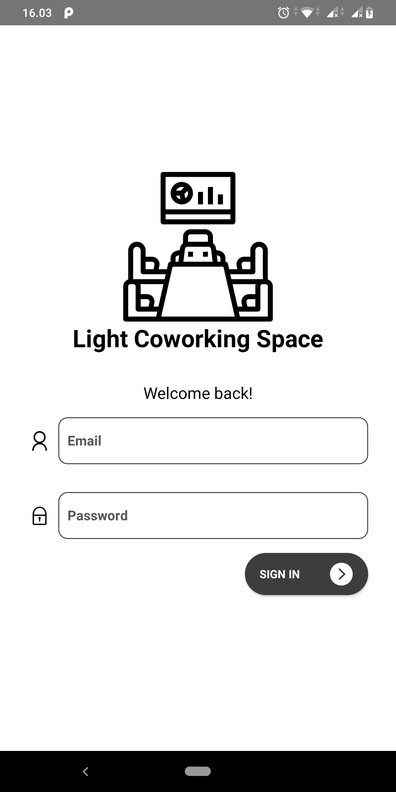
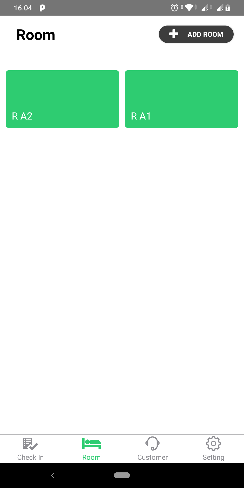
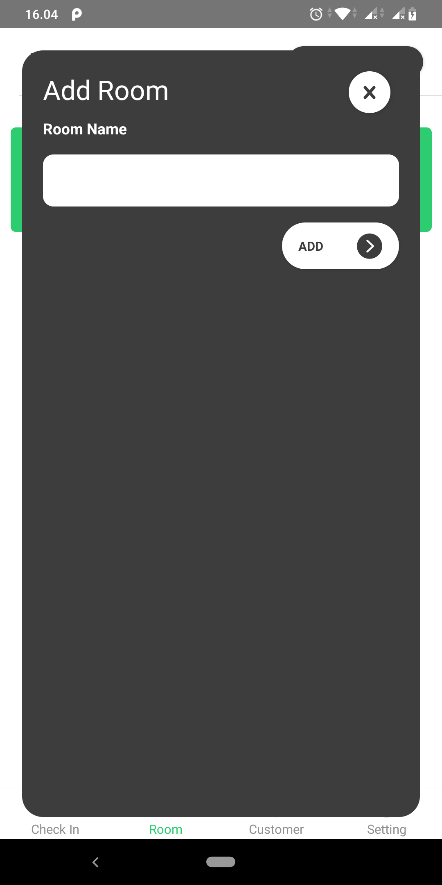
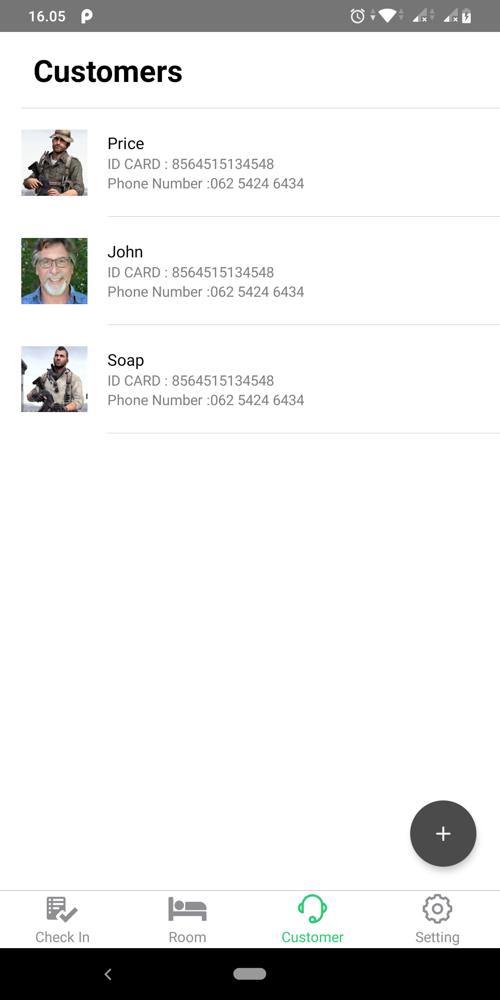
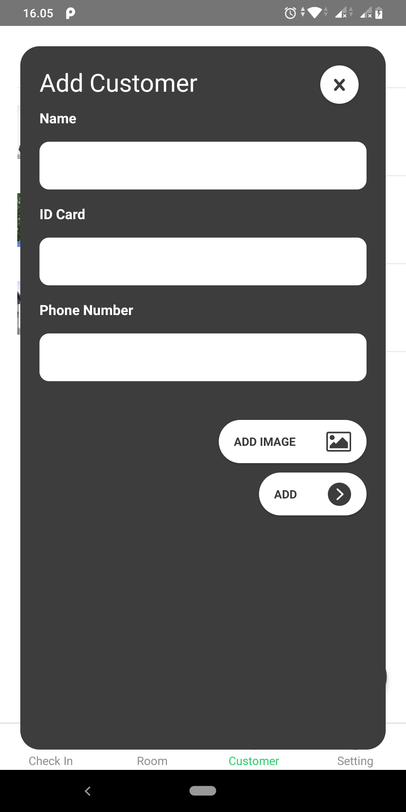
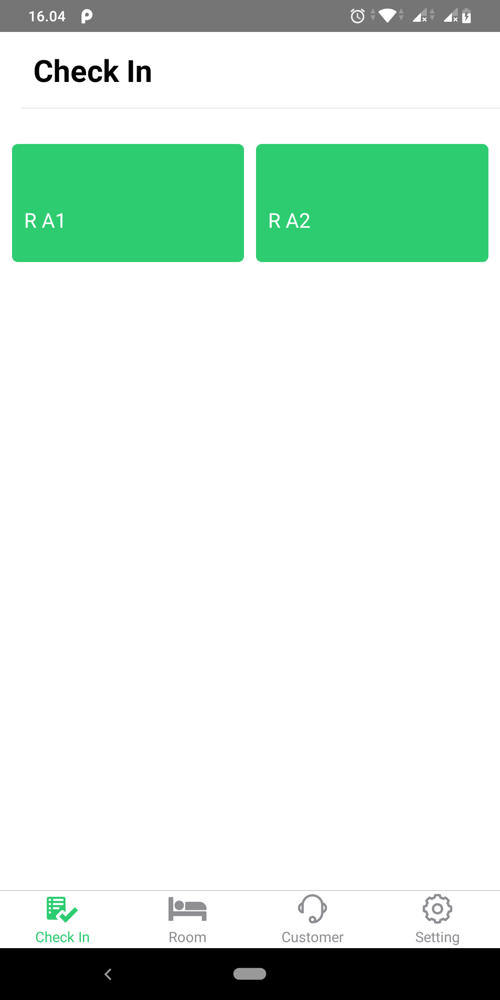
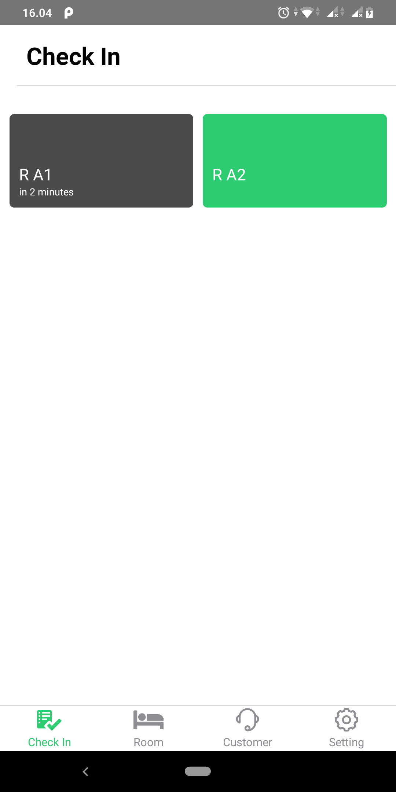

<h1 align="center">
  <br>
  Light Coworking Space
</h1>

## Important
this project has create for add skills in React Native.</br>
if found a problem or error, I'm sorry for that

## Light Coworking space
Light Coworking space is a platform android for booking room, and management booking system  


## Screenshots

<p float="left">
  
  
  
  
  
  
  
</p>


## Features
* Log In 
* Room Management
* Check in
* Check out
* Customer Management
* Auto update if booking is done


## Tech Stack
* React Native for the Mobile Frontend
* Express for backend
* Mysql for database

## Preinstall
* Make sure You had been install NodeJs in your system https://nodejs.org/
* Then install React Native https://facebook.github.io/react-native/
* and create a new project Express for backend
  https://expressjs.com/
  

## Installation & Configuration
Follow these step to install

**Frontend:**
```
$ git clone https://github.com/DumbWaysStudent/DW12LTSG3_Management_Room/tree/finaly
$ cd DW12LTSG3_Management_Room
$ npm install
$ react-native run-ios #for ios
$ react-native run-android #for android
```


**Backend:**
```
$ git clone https://github.com/DumbWaysStudent/DW12LTSG3_Management_Room/tree/finaly
$ cd DW12LTSG3_Management_Room/backend

create a database on mysql
config database in backend/config/config.json

in development setting 

"development": {
    "username": "your username", //default root
    "password": "your password, //default null
    "database": "your database", 
    "host": "your host", // default 127.0.0.1
    "dialect": "mysql
},

$ npm install
$ npm start
```

## Support Me :)
* Star this repository :star:
* Hire Me https://www.linkedin.com/in/dian-handiyansah-763aa9140/

## Contact 
* WA/TELEGRAM: +62 895 3546 36192
* email: dianhan8@gmail.com

* Thank You !